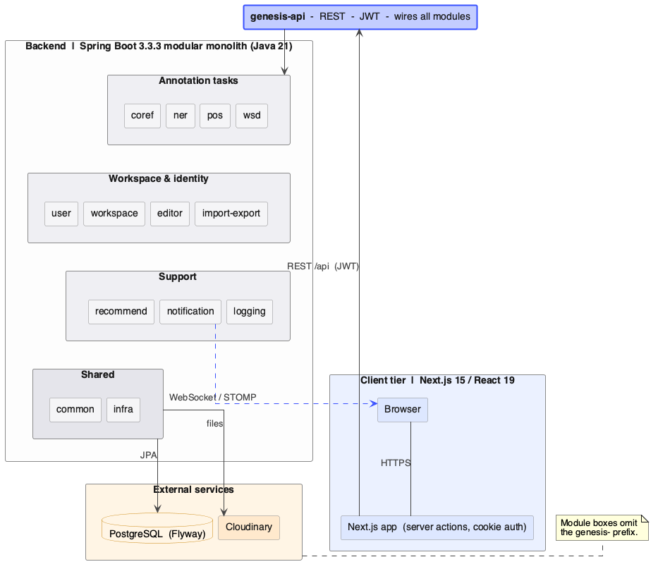
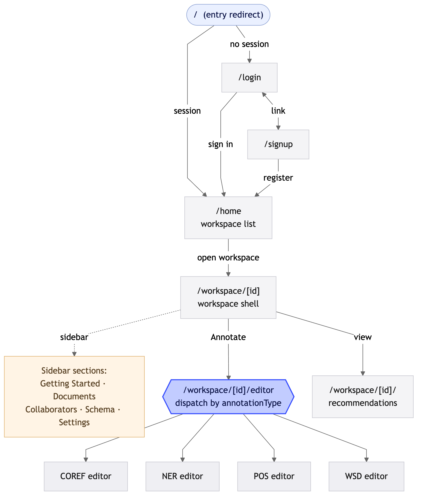
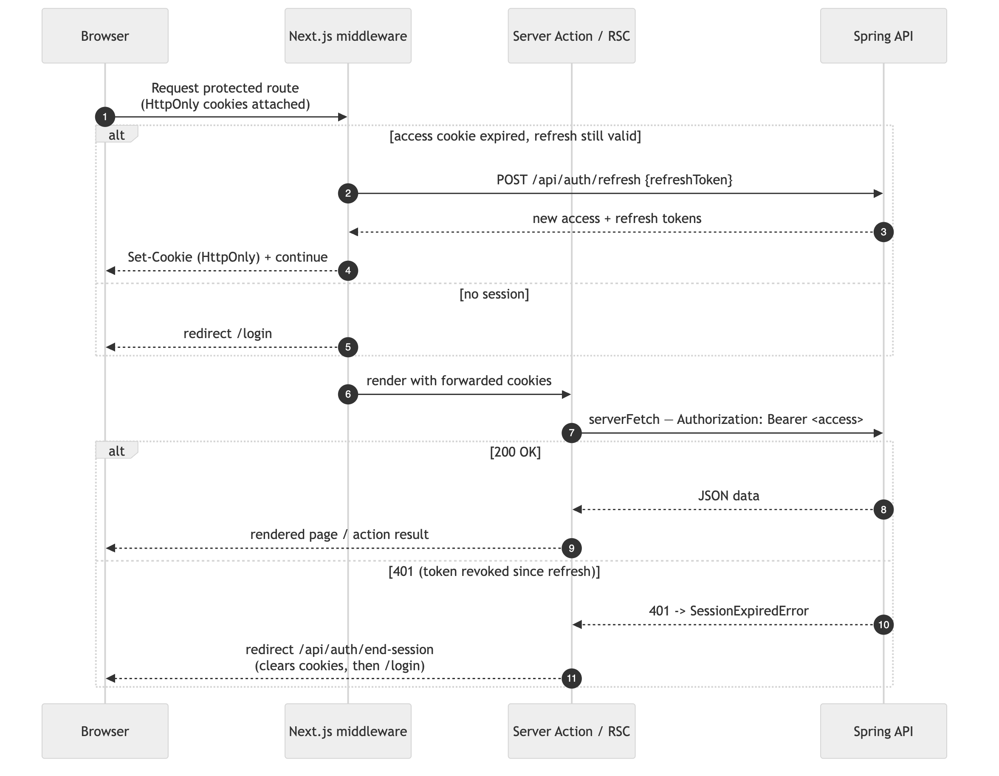

<h1 align="center">Genesis Frontend</h1>

<p align="center">
  <strong>The web client for the Genesis NLP annotation platform.</strong>
  <br/>
  Next.js 15 App Router · React 19 · TypeScript · Tailwind v4 · shadcn/ui.
</p>

<p align="center">
  
  
  
  
  
</p>

<p align="center">
  <a href="#overview">Overview</a> ·
  <a href="#features">Features</a> ·
  <a href="#tech-stack">Tech stack</a> ·
  <a href="#quick-start">Quick start</a> ·
  <a href="#configuration">Configuration</a> ·
  <a href="#project-structure">Project structure</a> ·
  <a href="#scripts">Scripts</a> ·
  <a href="#deployment">Deployment</a> ·
  <a href="#contributing">Contributing</a>
</p>

---

## Overview

Genesis is a full-stack NLP annotation platform for linguistics teams and ML data ops. This repository contains the **web client** — a Next.js 15 app that talks to the [Genesis backend](https://github.com/subarnasaikia/genesis) over REST + STOMP/WebSocket.

The app handles multi-task annotation workflows (coreference, named-entity recognition, part-of-speech tagging, word-sense disambiguation), workspace and team management, document import/export, and real-time notifications.

This web client is the browser-facing layer of the wider Genesis system — it talks only to the backend API over REST + STOMP:



## Features

- **Workspace dashboard** — Create, search, and switch between annotation projects with progress tracking and role-based access.
- **Editor** — Token-level editor with keyboard-driven labelling, multi-layer annotation, hover previews, and sentence pagination for large documents.
- **Per-task editors** — Coreference, POS, NER, and WSD each get a purpose-built editor surface backed by a shared session model.
- **Collaboration** — Invite annotators, assign roles (`ADMIN` / `ANNOTATOR` / `CURATOR`), and see who is working in real time.
- **Import & export** — TXT and CoNLL-2012 import, multi-document ZIP export, signed share-link export for read-only review.
- **Recommendations** — Active-learning hints surface candidate spans directly in the editor.
- **Realtime notifications** — STOMP/WebSocket bell with toast surfacing for invitations and workspace events.
- **JWT auth with auto-refresh** — Short-lived access tokens, silent refresh, server-side guarded routes in the App Router.

## Screenshots

> Full annotated screenshots of every screen — home, workspace overview, the four editors (coref / NER / POS / WSD), recommendations, notifications, import/export, and sharing — live in the **[User Guide](https://subarnasaikia.github.io/genesis-deploy/user-guide/)** of the published handbook.

## Tech stack

| Layer | Technology |
|---|---|
| Framework | **Next.js 15** App Router with React Server Components |
| Language | **TypeScript** strict mode |
| UI library | **React 19** + **shadcn/ui** (new-york preset) |
| Styling | **Tailwind CSS v4** with CSS variables + oklch palette |
| Forms | `react-hook-form` + `@hookform/resolvers` + `zod` |
| Realtime | `@stomp/stompjs` over `SockJS` |
| Icons | `lucide-react` |
| Package manager | **pnpm** |
| Bundler | **Turbopack** (dev + build) |
| Linter | ESLint flat config |

## Quick start

### Prerequisites

- **Node.js 18+** (Node 20 LTS recommended)
- **pnpm 9+** (`npm install -g pnpm`)
- A running [Genesis backend](https://github.com/subarnasaikia/genesis) (default `http://localhost:8080`)

### Install and run

```bash
git clone https://github.com/gautam84/genesis-frontend.git
cd genesis-frontend
pnpm install
cp .env.example .env.local         # if .env.example doesn't exist, see Configuration below
pnpm dev
```

The dev server starts on `http://localhost:3000`. Sign up, verify your email, and you'll land on the workspace dashboard.

## Configuration

Configure the API base URL and any client-visible flags via `.env.local`:

```env
# REST API origin — must match the backend's CORS_ALLOWED_ORIGINS entry
NEXT_PUBLIC_API_URL=http://localhost:8080

# Optional: override the WebSocket base if it differs from the API origin
# NEXT_PUBLIC_WS_URL=ws://localhost:8080/ws
```

> ⚠️ Anything prefixed `NEXT_PUBLIC_` is bundled into the client. **Never put secrets there.** Server-only secrets (e.g. revalidation tokens) belong in `.env.local` without the `NEXT_PUBLIC_` prefix and are read inside Server Components / Route Handlers only.

### Auth handshake

The backend issues a short-lived access token (15 min default) and a long-lived refresh token (7 days). The frontend stores both in `localStorage` via `tokenStorage` (see `src/lib/auth.tsx`). `fetchWithAuth` in `src/lib/api/client.ts` retries 401 responses once after silently refreshing — if the refresh fails, the user is redirected to `/login`.

Protected routes use `AuthGuard`; server-only data fetching uses the helpers in `src/lib/server/`.

## Project structure

The App Router routes form a guarded flow from auth through the workspace into the per-task editors:



Data flows from Server Components and Server Actions through the typed API layer to the backend, with client components hydrating from the `ApiResponse<T>` envelope:



```text
src/
├── app/                              # Next.js App Router
│   ├── layout.tsx                    # Root layout: Geist fonts, providers
│   ├── page.tsx                      # Redirects → /login
│   ├── login/                        # Login page
│   ├── signup/                       # Sign up page
│   ├── verify-email/                 # Email verification flow
│   ├── home/                         # Workspace dashboard
│   ├── workspace/[id]/               # Workspace detail
│   │   ├── editor/                   # Per-task editors (coref / ner / pos / wsd)
│   │   ├── recommendations/          # Active-learning hints
│   │   └── wsd-senses/               # Sense inventory
│   ├── api/                          # Route Handlers (export proxy, etc.)
│   └── error.tsx                     # Error boundary
├── components/
│   └── ui/                           # shadcn/ui components (button, dialog, ...)
├── hooks/                            # useEditorSession, ...
├── lib/
│   ├── api/                          # Client-side REST modules (browser fetch)
│   ├── server/                       # Server-side REST modules (RSC + Route Handlers)
│   ├── actions/                      # Server Actions (mutations)
│   ├── auth.tsx                      # AuthContext, AuthGuard, tokenStorage
│   ├── notifications.tsx             # STOMP/WebSocket provider
│   └── utils.ts                      # cn(), helpers
└── middleware.ts                     # Next.js middleware (route guarding)
```

### Patterns worth knowing

- **Client vs Server Components.** Pages that need `useRouter`, `useParams`, `useState`, or event handlers are marked `'use client'`. Everything else stays a server component by default — fetching happens in `src/lib/server/*` and rendered on the server.
- **Three API surfaces, one envelope.** Browser fetch (`src/lib/api/*`), server-side fetch (`src/lib/server/*`), and Server Actions (`src/lib/actions/*`) all consume the backend's `ApiResponse<T>` envelope and propagate auth context appropriately.
- **STOMP notifications.** `src/lib/notifications.tsx` opens a single STOMP connection over SockJS, subscribes to `/user/queue/notifications`, and reconnects with backoff. Components subscribe to the React context — no per-component sockets.
- **Tailwind v4 + CSS variables.** Brand colour `#3950FE` is `var(--primary)`. Use the `bg-[var(--primary)]` arbitrary-value syntax for one-offs; otherwise extend the theme in `globals.css`.

## Scripts

```bash
pnpm dev          # Start the dev server with Turbopack on :3000
pnpm build        # Production build with Turbopack
pnpm start        # Run the production server
pnpm lint         # ESLint over src/

# Adding a shadcn/ui component
pnpx shadcn@latest add <component-name>
```

## Deployment

The app is a standard Next.js application — any Node-compatible host works (Vercel, Railway, Fly.io, AWS Amplify, Docker).

A typical deploy:

1. Set `NEXT_PUBLIC_API_URL` to the public backend origin (`https://api.genesis.example`).
2. Ensure that origin is included in the backend's `CORS_ALLOWED_ORIGINS` env var — the production backend fails boot if it's unset and rejects mismatched origins at runtime.
3. Confirm the backend's WebSocket origin allowlist also includes the deployed frontend host (it reuses `cors.allowed-origins` — no separate config).
4. `pnpm build && pnpm start`, or push to Vercel for zero-config hosting.

## Browser support

- Latest **Chrome**, **Firefox**, **Edge**, **Safari**.
- Mobile Safari 16+ and Chrome for Android 110+.
- No IE11 or legacy Edge support.

## Repositories & documentation

Genesis ships from three repositories, each with a single responsibility:

| Repository | Role |
|---|---|
| [`gautam84/genesis-frontend`](https://github.com/gautam84/genesis-frontend) | **Frontend** — this repo. Next.js 15 web client. |
| [`subarnasaikia/genesis`](https://github.com/subarnasaikia/genesis) | **Backend** — Spring Boot API: auth, workspaces, annotation, notifications, import/export, PostgreSQL. |
| [`subarnasaikia/genesis-deploy`](https://github.com/subarnasaikia/genesis-deploy) | **Deployment** — Docker Compose stack, CI, and the documentation handbook. No application code. |

Each app repo uses two branches: **`main`** (latest reviewed state — every change lands via PR) and **`uni-prod`** (exactly what runs in production, updated from `main` via PR).

📖 **Full handbook** — architecture, functionality, user guide, deployment, and operations — is published from `genesis-deploy` to GitHub Pages:

> **<https://subarnasaikia.github.io/genesis-deploy/>**

The diagrams in this README are generated and version-controlled in the project report repository (`genesis-report-and-docs`) and mirrored into the deploy handbook.

## Contributing

Issues and PRs welcome.

- Branch from `main`; one task per branch, one PR per branch.
- Match the existing code style — `pnpm lint` should pass.
- Components live in `src/components/ui/` (shadcn) or close to their consumers; avoid premature shared abstractions.
- When adding a new annotation editor, mirror the `coref-editor` pattern: a client component that calls into `src/lib/api/<task>.ts` and persists session state through `useEditorSession`.

Commit messages follow the loose Conventional Commits shape used in this repo (`feat:`, `fix:`, `docs:`, `chore:`).

## License

License TBD — the repository is currently private/source-available. Reach out to the maintainers before redistribution.

## Acknowledgments

- Built with [Next.js](https://nextjs.org/), [shadcn/ui](https://ui.shadcn.com/), [Tailwind CSS](https://tailwindcss.com/), and [Lucide](https://lucide.dev/).
- Schema and label set inspired by **OntoNotes 5.0** and **CoNLL-2012**.

---

<p align="center">
  <a href="https://github.com/subarnasaikia/genesis">Backend</a> ·
  <a href="https://github.com/subarnasaikia/genesis-deploy">Deployment</a> ·
  <a href="https://subarnasaikia.github.io/genesis-deploy/">Handbook (GitHub Pages)</a>
</p>
